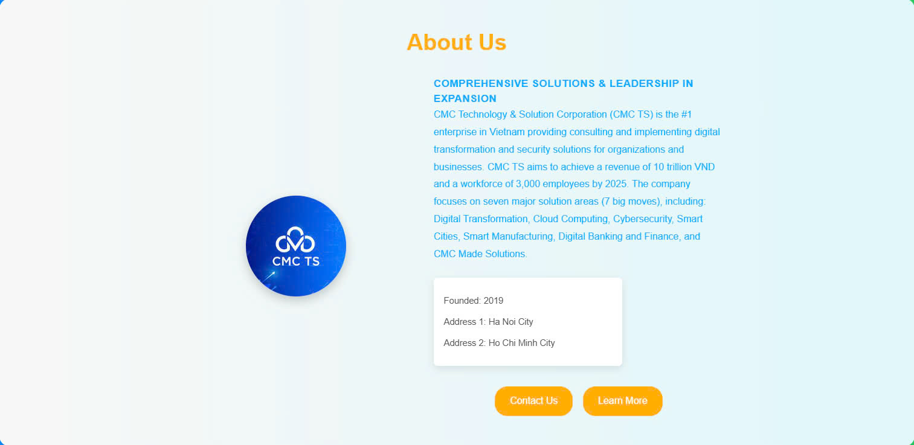

# Frontend Dashboard for CMC TS - Blob Storage Management

This project provides a **React-based frontend dashboard** for managing **Azure Blob Storage** files. The dashboard allows users to perform file operations like uploading, deleting, downloading files, and viewing the cost of storing data in Azure Blob Storage. Users authenticate using their **Microsoft account** for secure access to the storage resources.

## Features

- **Login with Microsoft Account**: Secure authentication via Microsoft Identity Platform.
- **Upload Files**: Allows users to upload files to Azure Blob Storage.
- **Delete Files**: Users can delete files from the Blob Storage containers.
- **Download Files**: Users can download files stored in Azure Blob Storage containers.
- **View Storage Costs**: Display the cost of storing files in containers, including storage usage metrics and billing insights.
- **Responsive UI**: The dashboard is designed to be responsive, ensuring that it works on both mobile and desktop devices.

## Tech Stack

- **Frontend**:  
  - **React**: A JavaScript library for building user interfaces.
  - **Vite**: A fast, modern build tool for JavaScript applications.
  - **Azure SDK for JavaScript**: To interact with Azure Blob Storage.
  - **Microsoft Authentication (MSAL.js)**: For Microsoft login and authentication.
  
- **Backend (Optional)**:  
  - You can extend this project to use a backend for enhanced security, or to store metadata and logs if needed.

## Prerequisites

Before running the project locally, make sure you have:

- **Node.js**: Version 14.x or higher.
- **npm** or **yarn**: Package managers to manage project dependencies.
- **Azure Subscription**: You need an Azure account with Blob Storage created.
- **Azure AD Application**: To authenticate users via Microsoft, you'll need to create an Azure Active Directory (Azure AD) app and get the **Client ID** and **Tenant ID**.

## Setup Instructions

- **Disable Handle** 

- **Install Dependencies, Libary**

- **Run the Development Server**

